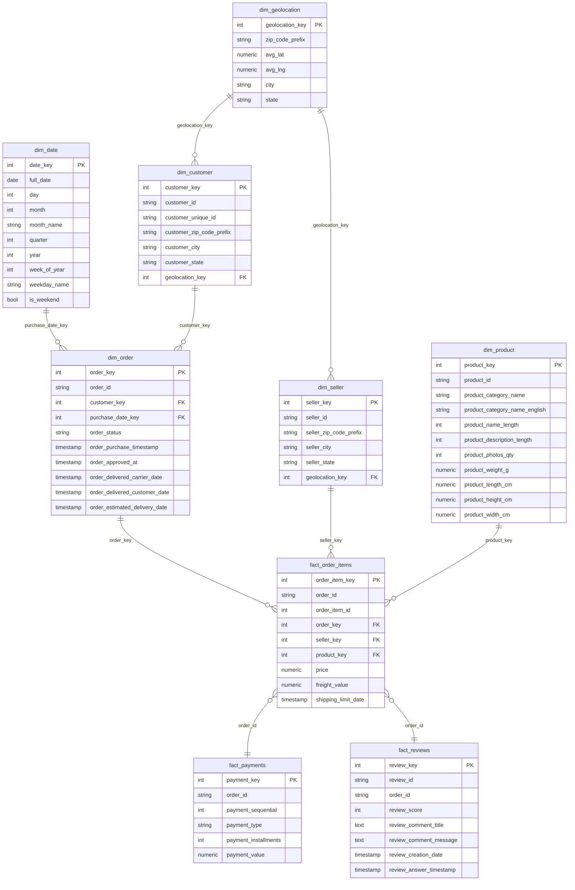

# Data Warehouse Schema
## Marketplace Analytics Platform

## 1. Overview

The warehouse is a star schema built in PostgreSQL, purpose-designed for customer-centric analysis across four business dimensions: customer intelligence, seller performance, product analytics, and regional geography.

The schema follows a multi-fact design rather than a single flat fact table. The primary fact table — `fact_order_items` — operates at line-item grain (one row per order line item). Two additional fact tables, `fact_payments` and `fact_reviews`, operate at order grain and are kept separate to avoid fan-out: joining multi-row payment records or reviews directly onto multi-row order items would multiply row counts and silently inflate revenue and review metrics. All three fact tables connect through `order_id` as a degenerate dimension.

Order-level fields (status, timestamps) are modeled in a dedicated `dim_order` dimension rather than denormalized onto `fact_order_items`. This replicates enterprise warehouse design practice — keeping the fact table lean and order attributes in a single authoritative location — at the cost of one additional join in most queries.

All dimension tables use surrogate integer keys (`SERIAL`) as primary keys, with natural business keys retained as regular columns. Geographic intelligence is modeled through `dim_geolocation` (one row per zip code prefix, deduplicated from the raw geolocation file) and accessed via foreign keys on `dim_customer` and `dim_seller` rather than directly on the fact table.

---

## 2. Entity Relationship Diagram



---

## 3. Table Descriptions

### dim_date
**Purpose:** Calendar dimension used for all time-based analysis and filtering. Generated programmatically — not loaded from a source CSV.
**Grain:** One row per calendar date.
**Row count:** 1,461 (2016-01-01 to 2019-12-31)
**Primary key:** `date_key` (YYYYMMDD integer)
**Foreign keys:** None

| Column | Type | Description |
|---|---|---|
| `date_key` | INTEGER | Surrogate PK in YYYYMMDD format (e.g. 20170315). Human-readable, sortable, and faster to join than a DATE type in most query engines. |
| `full_date` | DATE | Calendar date |
| `day` | SMALLINT | Day of month (1–31) |
| `month` | SMALLINT | Month number (1–12) |
| `month_name` | VARCHAR | Month name (e.g. March) |
| `quarter` | SMALLINT | Calendar quarter (1–4) |
| `year` | SMALLINT | Four-digit year |
| `week_of_year` | SMALLINT | ISO week number (1–53) |
| `weekday_name` | VARCHAR | Day name (e.g. Wednesday) |
| `is_weekend` | BOOLEAN | True for Saturday and Sunday |

---

### dim_customer
**Purpose:** Customer identity and location. Carries both the order-scoped `customer_id` (join key to orders) and the true person-level `customer_unique_id` (used for all customer-level analytics).
**Grain:** One row per `customer_id`.
**Row count:** 99,441
**Primary key:** `customer_key`
**Foreign keys:** `geolocation_key` → `dim_geolocation`

| Column | Type | Description |
|---|---|---|
| `customer_key` | SERIAL | Surrogate PK |
| `customer_id` | VARCHAR | Order-scoped natural key. A new `customer_id` is generated per order in Olist's system — this is the join key to `dim_order`, not a stable person identifier. |
| `customer_unique_id` | VARCHAR | True person-level identifier. Use this for all RFM, CLV, retention, and customer health analysis. |
| `customer_zip_code_prefix` | VARCHAR | 5-digit zip code prefix — join key to `dim_geolocation` via `geolocation_key` |
| `customer_city` | VARCHAR | Customer city |
| `customer_state` | CHAR(2) | Brazilian state abbreviation |
| `geolocation_key` | INTEGER | FK to `dim_geolocation` — resolved at ETL time via zip code prefix lookup |

---

### dim_seller
**Purpose:** Seller identity and location.
**Grain:** One row per `seller_id`.
**Row count:** 3,095
**Primary key:** `seller_key`
**Foreign keys:** `geolocation_key` → `dim_geolocation`

| Column | Type | Description |
|---|---|---|
| `seller_key` | SERIAL | Surrogate PK |
| `seller_id` | VARCHAR | Natural key — anonymized seller identifier |
| `seller_zip_code_prefix` | VARCHAR | 5-digit zip code prefix |
| `seller_city` | VARCHAR | Seller city |
| `seller_state` | CHAR(2) | Brazilian state abbreviation |
| `geolocation_key` | INTEGER | FK to `dim_geolocation` — resolved at ETL time via zip code prefix lookup |

---

### dim_product
**Purpose:** Product catalogue with English category names resolved at ETL time.
**Grain:** One row per `product_id`.
**Row count:** 32,951
**Primary key:** `product_key`
**Foreign keys:** None

| Column | Type | Description |
|---|---|---|
| `product_key` | SERIAL | Surrogate PK |
| `product_id` | VARCHAR | Natural key — anonymized product identifier |
| `product_category_name` | VARCHAR | Category in Portuguese. Null for 610 products. |
| `product_category_name_english` | VARCHAR | English category name joined from translation file at ETL time. Two categories manually mapped: `pc_gamer` → `gaming_pc`, `portateis_cozinha_e_preparadores_de_alimentos` → `portable_kitchen_food_preparators`. |
| `product_name_length` | INTEGER | Character count of product name. Source column has a typo (`lenght`) — corrected in warehouse. |
| `product_description_length` | INTEGER | Character count of product description. Same typo corrected. |
| `product_photos_qty` | INTEGER | Number of product photos |
| `product_weight_g` | NUMERIC | Product weight in grams. 4 rows with value 0 are set to null at ETL time. |
| `product_length_cm` | NUMERIC | Product length in centimetres |
| `product_height_cm` | NUMERIC | Product height in centimetres |
| `product_width_cm` | NUMERIC | Product width in centimetres |

---

### dim_geolocation
**Purpose:** Geographic coordinates for Brazilian zip code prefixes. Enables lat/lng heatmap analysis in Tableau. Deduplicated from 1,000,163 raw rows to one row per zip code prefix using average lat/lng.
**Grain:** One row per `zip_code_prefix`.
**Row count:** ~a few thousand unique prefixes (exact count confirmed at ETL load time)
**Primary key:** `geolocation_key`
**Foreign keys:** None

| Column | Type | Description |
|---|---|---|
| `geolocation_key` | SERIAL | Surrogate PK |
| `zip_code_prefix` | VARCHAR | 5-digit Brazilian postal code prefix. Natural key. Join target from `dim_customer` and `dim_seller`. |
| `avg_lat` | NUMERIC | Average latitude across all geocoded records for this prefix. 31 out-of-bounds rows excluded before averaging. |
| `avg_lng` | NUMERIC | Average longitude across all geocoded records for this prefix. Same exclusion applied. |
| `city` | VARCHAR | City name associated with this prefix |
| `state` | CHAR(2) | Brazilian state abbreviation |

---

### dim_order
**Purpose:** Order header dimension carrying all order-level attributes — status and all lifecycle timestamps. Kept as a separate dimension rather than denormalized onto `fact_order_items` to replicate enterprise warehouse design practice and keep the fact table lean.
**Grain:** One row per `order_id`.
**Row count:** 99,441
**Primary key:** `order_key`
**Foreign keys:** `customer_key` → `dim_customer`, `purchase_date_key` → `dim_date`

| Column | Type | Description |
|---|---|---|
| `order_key` | SERIAL | Surrogate PK |
| `order_id` | VARCHAR | Natural key — degenerate dimension carried on all three fact tables as the cross-fact join key |
| `customer_key` | INTEGER | FK to `dim_customer` |
| `purchase_date_key` | INTEGER | FK to `dim_date` — derived from `order_purchase_timestamp` date portion at ETL time |
| `order_status` | VARCHAR | Order status at time of data export |
| `order_purchase_timestamp` | TIMESTAMP | Date and time customer placed the order |
| `order_approved_at` | TIMESTAMP | Date and time payment was approved. Null for 160 orders. |
| `order_delivered_carrier_date` | TIMESTAMP | Date and time seller handed package to carrier. Null for 1,783 orders. Not used in delivery-time metrics — see methodology. |
| `order_delivered_customer_date` | TIMESTAMP | Date and time customer received package. Null for 2,965 orders. Primary endpoint for delivery-time calculations. |
| `order_estimated_delivery_date` | TIMESTAMP | Estimated delivery date shown to customer at purchase time |

---

### fact_order_items
**Purpose:** Primary fact table. One row per order line item — the lowest grain in the warehouse. Contains all item-level measures (price, freight) and foreign keys to all relevant dimensions.
**Grain:** One row per `(order_id, order_item_id)`.
**Row count:** 112,650
**Primary key:** `order_item_key`
**Foreign keys:** `order_key` → `dim_order`, `seller_key` → `dim_seller`, `product_key` → `dim_product`

| Column | Type | Description |
|---|---|---|
| `order_item_key` | SERIAL | Surrogate PK |
| `order_id` | VARCHAR | Degenerate dimension — natural join key to `fact_payments` and `fact_reviews` |
| `order_item_id` | SMALLINT | Sequential item number within an order (1 to max 21) |
| `order_key` | INTEGER | FK to `dim_order` |
| `seller_key` | INTEGER | FK to `dim_seller` |
| `product_key` | INTEGER | FK to `dim_product` |
| `price` | NUMERIC | Item sale price in BRL excluding freight. Primary revenue measure. |
| `freight_value` | NUMERIC | Freight cost allocated to this item in BRL |
| `shipping_limit_date` | TIMESTAMP | Seller's handling deadline. 4 outlier rows with 2020 dates are nulled out at ETL time. |

---

### fact_payments
**Purpose:** Payment records at installment sequence grain. Kept separate from `fact_order_items` to avoid fan-out — multiple payment rows per order would multiply item rows if joined directly.
**Grain:** One row per `(order_id, payment_sequential)`.
**Row count:** 103,886
**Primary key:** `payment_key`
**Foreign keys:** None (joins to `fact_order_items` via `order_id`)

| Column | Type | Description |
|---|---|---|
| `payment_key` | SERIAL | Surrogate PK |
| `order_id` | VARCHAR | Degenerate dimension — join key to `fact_order_items` and `dim_order` |
| `payment_sequential` | SMALLINT | Payment sequence number within an order (starts at 1) |
| `payment_type` | VARCHAR | Payment method: `credit_card`, `boleto`, `voucher`, `debit_card`, `not_defined` |
| `payment_installments` | SMALLINT | Number of installments. 2 rows with value 0 are set to 1 at ETL time. |
| `payment_value` | NUMERIC | Total payment value in BRL for this payment record |

---

### fact_reviews
**Purpose:** Customer review records. Kept separate from `fact_order_items` to avoid fan-out — 814 review_ids are attached to multiple order_ids due to Olist's split-seller checkout behavior.
**Grain:** One row per review record (one row per `order_id` in most cases).
**Row count:** 99,224
**Primary key:** `review_key`
**Foreign keys:** None (joins to `fact_order_items` via `order_id`)

| Column | Type | Description |
|---|---|---|
| `review_key` | SERIAL | Surrogate PK |
| `review_id` | VARCHAR | Natural review identifier. Not unique — 814 values appear on multiple orders due to split-seller checkout fan-out. Always use `COUNT(DISTINCT review_id)` when counting reviews. |
| `order_id` | VARCHAR | Degenerate dimension — join key to `fact_order_items` and `dim_order` |
| `review_score` | SMALLINT | Star rating 1–5. Always populated. |
| `review_comment_title` | TEXT | Optional review title in Portuguese. Null in 88% of records. |
| `review_comment_message` | TEXT | Optional review body in Portuguese. Null in 59% of records. Stored for future NLP analysis. |
| `review_creation_date` | TIMESTAMP | Date review survey was sent to customer |
| `review_answer_timestamp` | TIMESTAMP | Date and time customer submitted the review |

---

## 4. Design Decisions

| # | Decision | Rationale |
|---|---|---|
| 1 | Three fact tables instead of one | Joining multi-row payments or reviews onto multi-row order items causes fan-out — row counts multiply, inflating revenue and review metrics. Separate fact tables at the correct grain prevent this. |
| 2 | Separate `dim_order` instead of denormalizing onto fact table | Enterprise warehouse practice — keeps the fact table lean, order attributes in one authoritative location, and demonstrates professional schema design. |
| 3 | Geolocation joins via `dim_customer` and `dim_seller` | Geographic location is a property of a customer or seller, not of an order line item directly. Joining through dimension tables is semantically correct and keeps the fact table foreign key count minimal. |
| 4 | Surrogate integer keys on all dimension tables | Faster joins than VARCHAR hashes, protects against upstream natural key changes, and is the enterprise standard. Natural keys retained as regular columns for readability. |
| 5 | `dim_date` generated programmatically (2016–2019) | No source CSV exists for dates. Programmatic generation ensures complete, gap-free coverage across the full dataset range with buffer. |
| 6 | `dim_geolocation` at zip code prefix grain (avg lat/lng) | Raw file has 1,000,163 rows with 261,831 duplicates — one row per prefix is the correct analytical grain. Average lat/lng per prefix gives a representative central point for heatmap plotting. |

---

## 5. Common Join Paths

These are the join patterns used most frequently in SQL views and Tableau dashboards.

**Revenue by customer state:**
```
fact_order_items → dim_order → dim_customer → (customer_state)
```

**Revenue by customer location on map:**
```
fact_order_items → dim_order → dim_customer → dim_geolocation → (avg_lat, avg_lng)
```

**Delivery time per order:**
```
fact_order_items → dim_order → (order_delivered_customer_date - order_purchase_timestamp)
```

**Review score per seller:**
```
fact_reviews → (order_id) → fact_order_items → dim_seller → (seller_id)
```

**Revenue by product category over time:**
```
fact_order_items → dim_product → (product_category_name_english)
fact_order_items → dim_order → dim_date → (year, month)
```

**Customer lifetime value:**
```
fact_order_items → dim_order → dim_customer → (customer_unique_id)
GROUP BY customer_unique_id, SUM(price)
```

**Payment type mix by state:**
```
fact_payments → (order_id) → dim_order → dim_customer → (customer_state)
JOIN fact_payments → (payment_type, payment_value)
```

---
